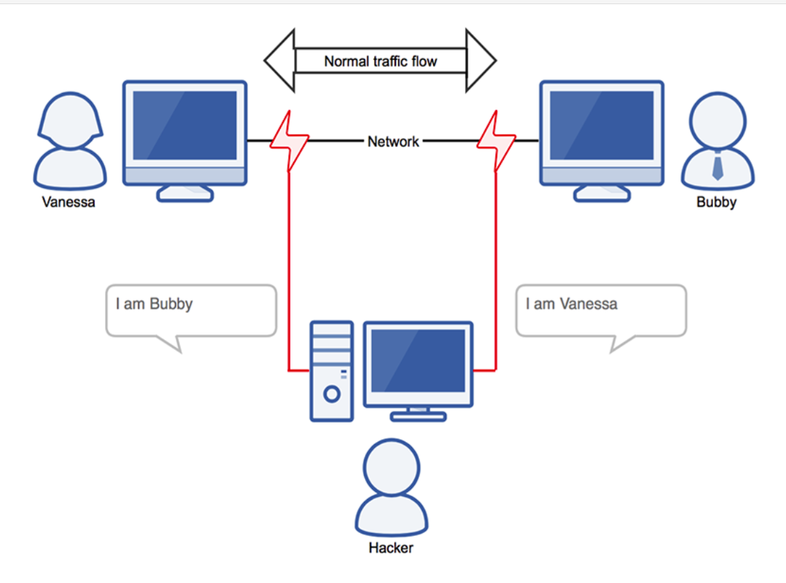

# Attack is the best defense

Security is a vast topic, and network security is an important part of it. A lot of very sensitive information goes over networks that are used by many people, and some people might have bad intentions. Traffic going through a network can be intercepted by a malicious machine pretending to be another network device. Once the traffic is redirected to the malicious machine, the hacker can keep a copy of it and analyze it for potential interesting information. It is important to note that the traffic must then be forwarded to the actual device it was supposed to go (so that users and the system keep going as if nothing happened).

Any information that is not encrypted and sniffed by an attacker can be seen by the attacker - that could be your email password or credit card information. While today’s network security is much stronger than it used to be, there are still some legacy systems that are using unencrypted communication means. A popular one is telnet.

In this project, we will not go over ARP spoofing, but we’ll start by sniffing unencrypted traffic and getting information out of it.

## Task 0:

user_authenticating_into_server that performs the authentication steps that I just showed above. Your mission is to execute user_authenticating_into_server locally on your machine and, using tcpdump, sniff the network to find my password. Once you find it, paste the password in your answer file.

## Task 1:

Password-based authentication systems can be easily broken by using a dictionary attack (you’ll have to find your own password dictionary). Let’s try it on an SSH account.
